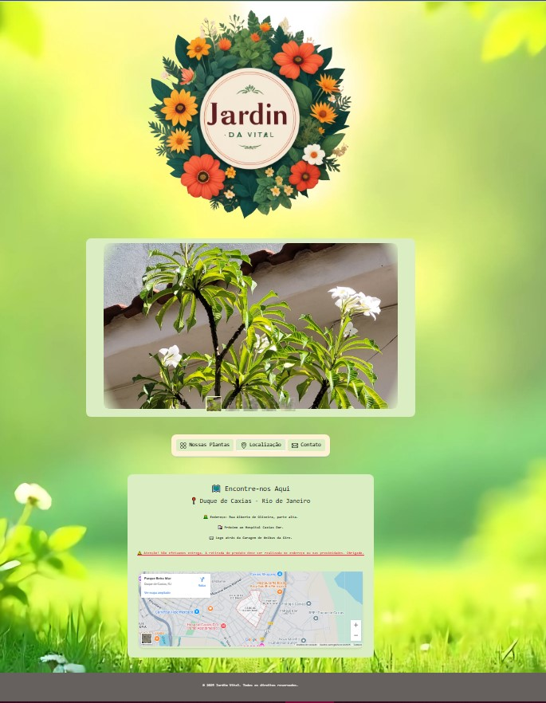
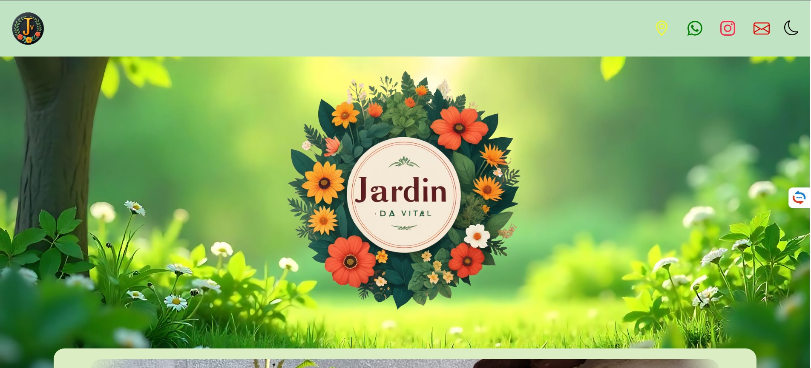
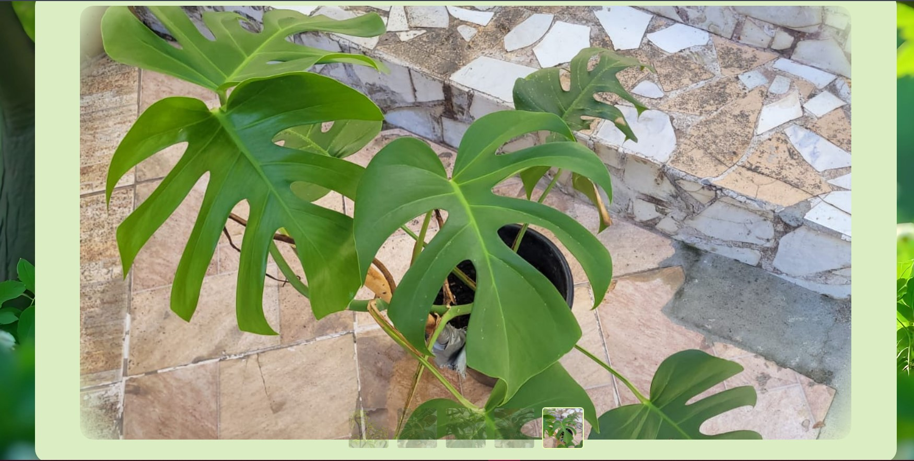
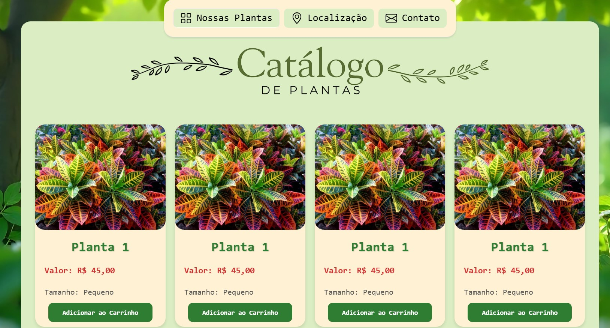
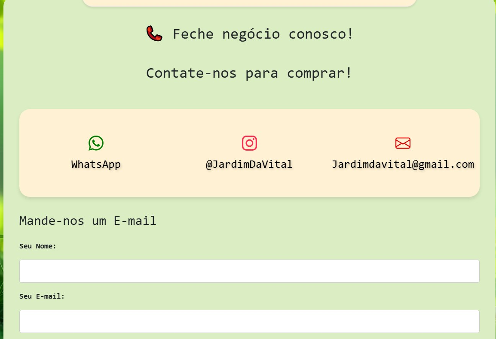
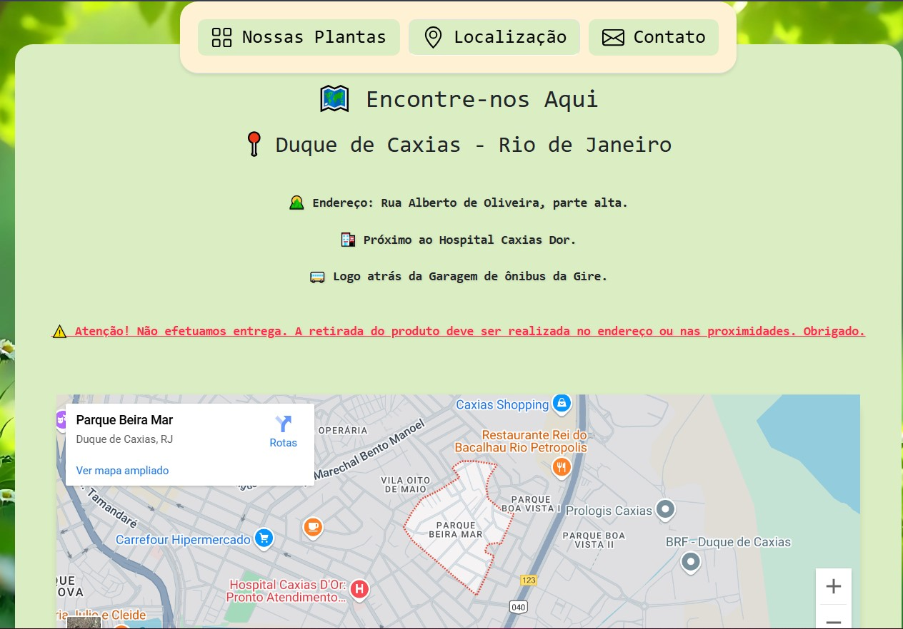

# Jardim Vital - Landing Page para Loja de Plantas (Projeto de Extensão - PEX)


## 📝 Descrição

Este projeto consiste no desenvolvimento de uma landing page interativa e responsiva para a loja de plantas local "Jardim Vital". Foi realizado como parte do **Projeto de Extensão (PEX)** da faculdade, com o objetivo de aplicar conhecimentos de desenvolvimento web front-end para criar uma presença online funcional e atraente para um pequeno negócio.

A página apresenta informações sobre a loja, um catálogo visual de produtos, detalhes de contato e localização.

**Nota:** A estrutura e funcionalidades principais estão implementadas. A atualização final das informações das plantas (nomes, preços, imagens) está pendente.

<!-- Adicionando Screenshots -->


*Visão geral da página no modo claro.*


*Visão do cabeçalho, topo da página.*


*Visão do carrousel da página.*


*Exemplo do catálogo de produtos.*


*Visão da aba de contatos, com formulário para envio de e-mail.*


*Visualização da aba de localização. Com endereço e google maps integrado*


<!-- Fim dos Screenshots -->

## ✨ Funcionalidades Principais

*   **Design Responsivo:** Interface adaptada para visualização em desktops, tablets e smartphones.
*   **Carrossel de Imagens:** Exibição dinâmica de fotos de plantas (utilizando Shoelace).
*   **Navegação por Abas:** Organização do conteúdo em seções (Nossas Plantas, Localização, Contato) (utilizando Bootstrap 5).
*   **Catálogo de Produtos:** Grade visual com cards de plantas, incluindo imagem, nome, preço e tamanho (com dados de exemplo).
*   **"Adicionar ao Carrinho":** Funcionalidade simulada que adiciona itens a uma área de texto no formulário de contato e exibe notificações.
*   **Modo Noturno:** Alternância entre tema claro e escuro, com persistência da preferência do usuário (localStorage) e ícone dinâmico.
*   **Formulário de Contato:** Campos para nome, e-mail, mensagem e exibição dos itens do "carrinho". (Nota: O envio real do e-mail não está implementado neste front-end).
*   **Mapa de Localização:** Integração com Google Maps Embed API para mostrar o endereço da loja.
*   **Notificações:** Mensagens (toasts) para feedback ao usuário (adição ao carrinho, aviso de WhatsApp).

## 🚀 Tecnologias Utilizadas

*   **HTML5:** Estruturação semântica do conteúdo.
*   **CSS3:** Estilização, layout (Flexbox, Grid), responsividade (Media Queries) e animações.
*   **JavaScript (ES6+):** Interatividade, manipulação do DOM, modo noturno, carrossel, validação de formulário (básica), notificações.
*   **Bootstrap 5:** Componente de Abas (Tabs).
*   **Shoelace:** Componentes Web (Carousel, Icon Button, Icon).
*   **Google Maps Embed API:** Exibição do mapa.

## 🔧 Como Executar Localmente


1.  Clone este repositório: `git clone https://github.com/seu-usuario/seu-repositorio.git`
2.  Navegue até a pasta do projeto: `cd PEX---Loja-de-Plantas`
3.  Instale as dependências do Node.js: `npm install`
4.  Crie um arquivo `.env` na raiz do projeto com a seguinte estrutura, substituindo pelos seus dados:
    ```dotenv
    EMAIL_USER=seu_email_remetente@gmail.com
    EMAIL_PASS=sua_senha_de_app_ou_senha
    EMAIL_DESTINO=seu_email_destino@exemplo.com
    ```
5.  Inicie o servidor: `node server.js`
6.  Abra seu navegador e acesse `http://localhost:3000`.

*(O envio de e-mail pelo formulário só funcionará se as credenciais no `.env` estiverem corretas).*

## 🔗 Deploy 

Você pode visualizar o projeto em funcionamento [aqui](link-para-seu-deploy.com). *(Substitua pelo link real se você hospedar o site)*

## 👨‍💻 Autor

*   **[Cristhian Campelo]** - [campelo.cfc@gmail.com]
