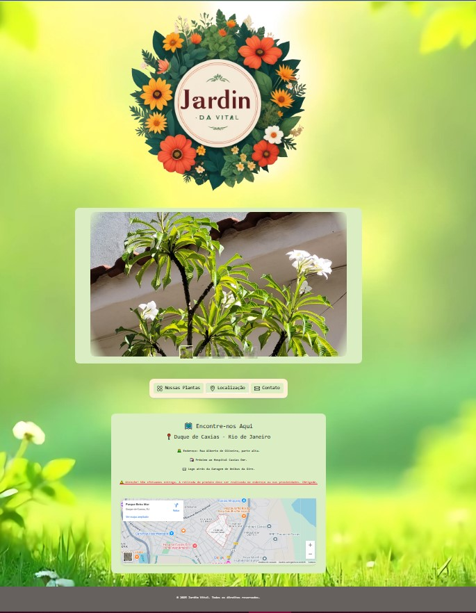
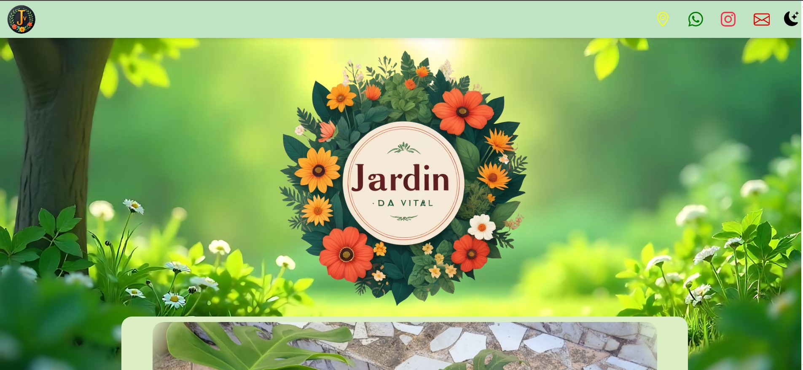
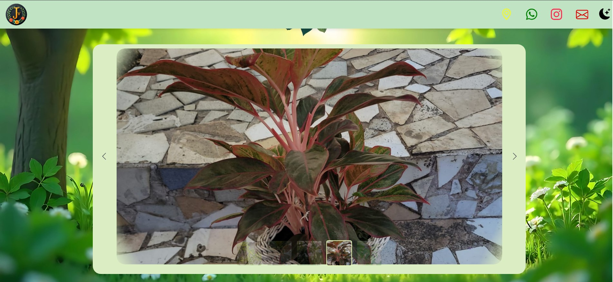
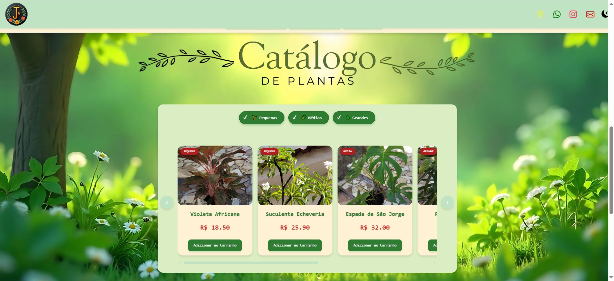
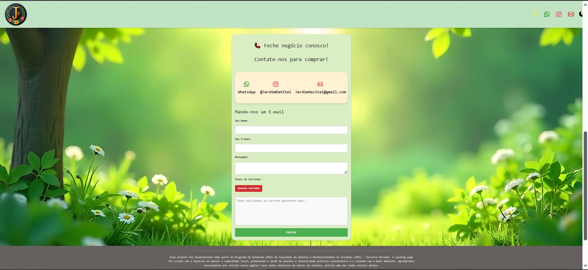
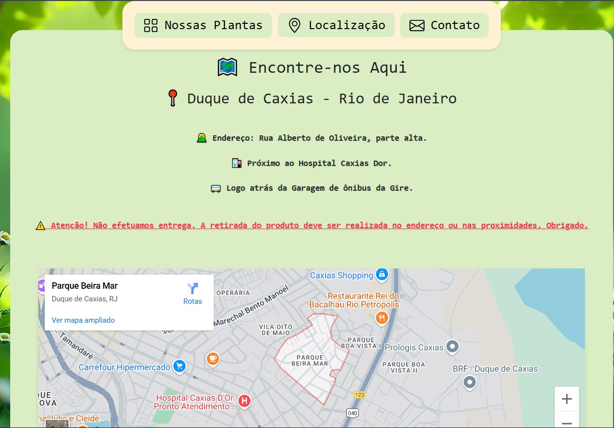

# Jardim Vital - Landing Page para Loja de Plantas (Projeto de Extensão - PEX)


🔗 **Acesse o projeto online:** [Jardim Vital - GitHub Pages](https://kriskinze.github.io/PEX-Loja-de-Plantas/)

## 📝 Descrição

Este projeto consiste no desenvolvimento de uma landing page interativa e responsiva para a loja de plantas local "Jardim Vital". Foi realizado como parte do **Projeto de Extensão (PEX)** da faculdade, com o objetivo de aplicar conhecimentos de desenvolvimento web front-end e back-end para criar uma presença online funcional e atraente para um pequeno negócio.

## 🆕 ATUALIZAÇÃO (Novembro 2025)

Esta versão traz correções críticas e expansão de conteúdo para o ambiente de produção:

*   **Correção de Caminhos de Imagens (GitHub Pages):** Atualização em massa no banco de dados para incluir o prefixo `public/` nos caminhos das imagens. Isso resolve o problema onde as imagens não carregavam no site hospedado, pois o GitHub Pages requer o caminho completo relativo à raiz do repositório.
*   **Deploy no Render (Backend):** Ajuste no `server.js` para utilizar a porta dinâmica (`process.env.PORT`), solucionando falhas de inicialização no serviço de hospedagem Render.
*   **Expansão do Catálogo:** O banco de dados foi populado com **46 espécies de plantas**, categorizadas por tamanho (Pequena, Média, Grande).
*   **Padronização:** Implementação de convenção de nomenclatura para arquivos de imagem e scripts de automação para popular o banco.

---

## ✨ Funcionalidades Principais

### Interface e Navegação
*   **Design Responsivo:** Interface totalmente adaptada para desktops, tablets e smartphones.
*   **Menu Sticky:** Menu de navegação fixo no topo para facilitar o acesso às seções.
*   **Modo Noturno:** Alternância entre tema claro e escuro com persistência de preferência.
*   **Navegação por Abas:** Organização clara em seções: Nossas Plantas, Localização, Contato.

### Catálogo e Compras
*   **Catálogo Dinâmico:** Produtos carregados via API REST integrada ao banco de dados SQLite.
*   **Filtros de Tamanho:** Filtragem visual de plantas por porte (Pequena, Média, Grande).
*   **Carrinho de Compras:** Adição de itens, visualização de resumo e notificação visual (Toast).
*   **Formulário de Contato:** Envio de pedidos e dúvidas diretamente por e-mail.

## 🚀 Tecnologias Utilizadas

*   **Frontend:** HTML5, CSS3, JavaScript (ES6+), Bootstrap 5, Shoelace Components.
*   **Backend:** Node.js, Express, SQLite3.
*   **Integrações:** Google Maps API, Nodemailer.
*   **Hospedagem:** GitHub Pages (Frontend), Render (Backend).

## 📸 Screenshots


*Visão geral da página no modo claro.*


*Visão do cabeçalho, topo da página.*


*Visão do carrousel da página.*


*Exemplo do catálogo de produtos.*


*Visão da aba de contatos, com formulário para envio de e-mail.*


*Visualização da aba de localização. Com endereço e google maps integrado*

## 🔧 Como Executar Localmente

1.  **Clone o repositório:**
    ```bash
    git clone https://github.com/KrisKinze/PEX-Loja-de-Plantas.git
    cd PEX-Loja-de-Plantas
    ```

2.  **Instale as dependências:**
    ```bash
    npm install
    ```

3.  **Configure as variáveis de ambiente:**
    Crie um arquivo `.env` na pasta `api/` com as credenciais de e-mail (necessário para o formulário de contato).

4.  **Inicie o servidor:**
    ```bash
    npm start
    ```
    O servidor rodará em `http://localhost:3000`.

5.  **Popule o Banco de Dados (Opcional):**
    Para resetar e popular o banco com os dados mais recentes:
    ```bash
    node api/database/popular-banco.js
    ```

## 👨‍💻 Autor

*   **Cristhian Campelo** - campelo.cfc@gmail.com
